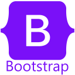

    

<h1 align="center">Hi 👋, I'm Fernando Areosa</h1>
<h3 align="center">A passionate Fullstack developer from Argentina</h3>

- 🌱 I’m currently learning **Django and SQL**

- 💬 Ask me about **React, Node and Python**

- 📫 How to reach me **[fer.areosa@gmail.com](mailto:fer.areosa@gmail.com)**

- ⚡ Fun fact **I love Star Wars and Star Trek too**

<h3 align="left">Connect with me:</h3>

<h3 align="left">Languages and Tools:</h3>

                     

&nbsp;

